# 前言

本文是从书籍[《垃圾回收的算法与实现》](https://book.douban.com/subject/26821357/)学习总结得到

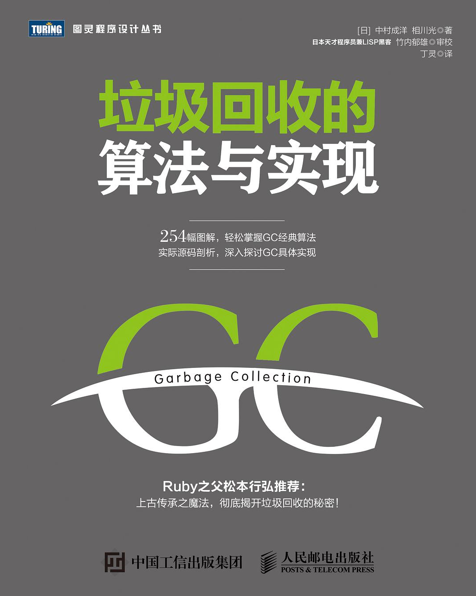

## gc的作用

如果没有gc，程序员将会需要自己手动管理内存，例如使用C/C++, 需要使用配套的malloc/free new/delete 等函数进行内存管理，不仅仅是对于初学者，都容易会遗忘进行内存释放。虽然C++11后也出现了智能指针协助管理内存，但是相对于python、golang这些语言而言，无疑还是非常难以使用。

一旦用户忘了释放内存，就会产生内存泄漏，内存泄漏，将会降低计算机的性能，更为严重的可能会导致设备崩溃。具体可以查看 [维基百科内存泄漏](https://zh.wikipedia.org/wiki/%E5%86%85%E5%AD%98%E6%B3%84%E6%BC%8F).

## gc的历史

最早的gc标记-清除算法由John McCarthy于1960年发布，同年George E. Collins 发布了gc引用计数算法，又三年，Marvin L. Minsky在论文中发布了gc复制算法。

然而这么多年来基础的gc算法没有任何改变，所谓新的gc算法都是由上面三种算法组合演变而来。

# 基础概念介绍

## 栈 (Stack)
32位linux的内存布局如下 

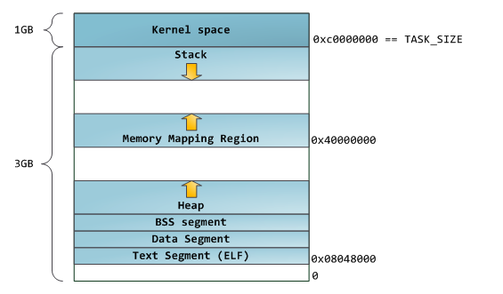

64位linux的内存布局如下 

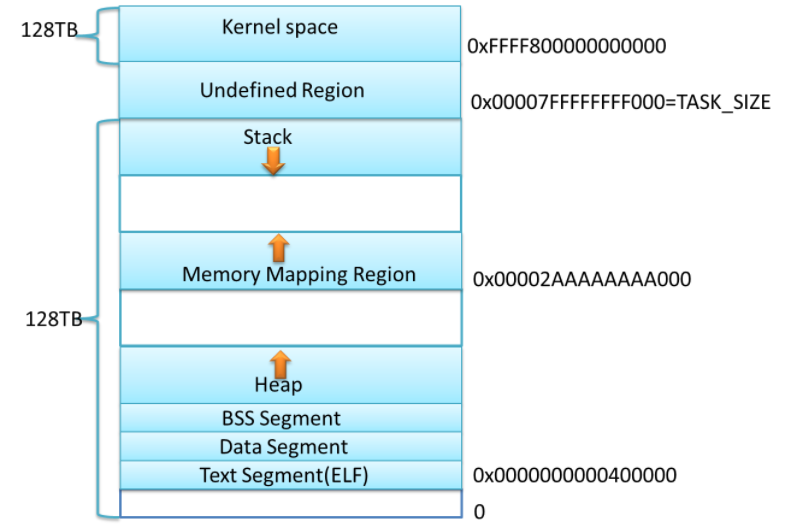

栈是后进先出（LIFO, Last In First Out）的原理运作，保证了数据的绝对顺讯，因此很方便控制内存的分配与回收，内存回收可以无需理会。

linux的栈大小可以使用命令```ulimit -a```查看，大部分系统默认8M，这个值也可以改动。

## 堆
堆的使用非常复杂，上面提到的malloc/free new/delete 等函数就是使用的堆的内存，一个程序可能对应多个堆，因为多线程的原因。

## 分块

分块(chunk)在gc的世界里指的是为利用对象而实现准备出来的空间。

## mutator
实体就是应用程序，gc在这内部运行。直接翻译是不知道是什么意思，是dijkstra想的词。

## 根
```
var a = Object.new
a.field1 = Object.new
```
例如上面的全局变量就是gc的根，而根就是被mutator直接调用的对象。

因此，调用栈跟寄存器、全局变量空间都是根

## 评价标准

1. 吞吐量：单位时间的处理能力，如果gc的总时间太长了，吞吐量自然就不行。(HEAD_SIZE/GC_TIME)
2. 最大暂停时间：例如需要暂停进行gc的时候，这个时候gc如果停的时间太长，那么就会给用户的感觉就是卡主了。因此gc在这个指标上面需要比较小才行。
3. 堆使用效率：例如gc复制算法只能利用一半的量，而引用计数法等就能利用全部的堆。以及非真实数据，存储指针等数据的占用量(这个相对来讲影响看起来不会特别明显，本文不涉及)
4. 访问的局部性：因为具有引用关系的内存大概率存在连续访问的情况，所以最好能够把他们放在同一个内存块中。

# gc标记-清除算法

分为两个阶段: 标记阶段、清除节点

## 标记阶段

从根开始，不断递归循环下去找遍所有的活跃对象，并且标记上。
```
mark_phase(){
    for(r: $roots)
        mark(*r)
}

mark(obj) {
    if obj.mark == False {
        obj.mark = True
        for child: children(obj) {
            mark(*child)
        }
    }
}
```
此方式是深度搜索 DFS，搜索顺序如图序号

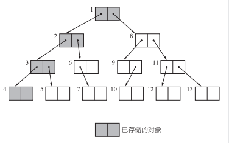

当然我们这里也能使用宽度搜索BFS，搜索顺序如图序号，即先搜索了每一层的数据，再搜索下一层的数据

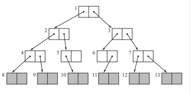


两种搜索各有优缺点，最明显的缺点如：
1. 深度搜索：容易爆栈，假如用户故意搞事情的话
2. 宽度搜索：就会导致不能访问的局部性，因为有引用关系的数据不在一个内存块，导致查找一个大的数据结构的时候，会从多个内存点查找数据。

上面这个两个问题可以通过局部深搜，全局宽搜来进行解决

## 清理阶段

对没有标记的内存，进行回收，回收至空闲链表
```
sweep_phase() {
    sweeping = $heap_start
    while(sweeping < $heap_end>) {
        if sweeping.mark == True {
            sweeping.mark = False
        } else {
            sweeping.next = $free_list
            $free_list = sweeping
        }
        sweeping += sweeping.size
    }
}
```
最终将产生如下的形式的数据结构

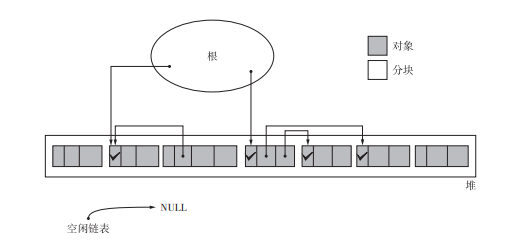

上面这里其实可以进行优化，如合并连续的内存块

下面我觉得只是简单合并了一下，只是提供了一种思路，实际上的合并操作应该会比这里更加复杂才对。
```
sweep_phase() {
    sweeping = $heap_start
    while(sweeping < $heap_end>) {
        if sweeping.mark == True {
            sweeping.mark = False
        } else {
            if sweeping == $free_list + $free_list.size {
                free_list.size += sweeping.size
            } else {
                sweeping.next = $free_list
                $free_list = sweeping
            }
        }
        sweeping += sweeping.size
    }
}
```

## 分配
由于我们已经拥有了空闲链表，所以直接去空闲链表上面申请合适大小的内存即可

分配的方式有三种：
1. First-fit: 一旦发现大于等于申请的size的时候就返回给mutator
2. Best-fit: 返回大于等于size的最小分块给mutator
3. Worst-fit: 返回最大的分块

时机操作过程中一般都是使用First-fit的分配方式。

## 优缺点
优点：算法简单容易理解，实现的代码也可以多种多样
缺点：容易造成碎片化，假如分配内存的时候是使用First-fit方式，就会产生大量细小的碎片，window系统之前也是会有大量碎片，还需要我们手动点击整理碎片

解决办法：
1. 多个空闲链表。例如长度固定为4字节、8字节。。。最终维护一个很大内存块的链表。每次mutator来申请的时候找到合适的链表，然后分配对应链表上面一个整块给它，不管它是否用得完，最后回收的时候也是回收一个整块。同样的，对于大的块，也会产生碎片，但是大的内存块去申请的相对来讲比较少。所以这也是一个优化点。同时也带来了内存的使用效率减少的缺点。

todo 补充图

2. 不是解决办法的延迟清理技术：即等到没有内存可以分配的时候才进行清理内存，虽然可以在前期减少mutator减少最大的暂停时间，但是后期的清理会大大增加清理的负担。

# gc引用计数法
如python就是使用了这个算法，请见另外一篇学习笔记

# gc复制算法
将内存分为两个一模一样大小的空间，当From空间被占满的时候，复制到To空间去，同时也会递归复制引用的子对象，通过复制算法，做到了没有碎片的问题，因为copy过程中又重新整理了一下内存布局。

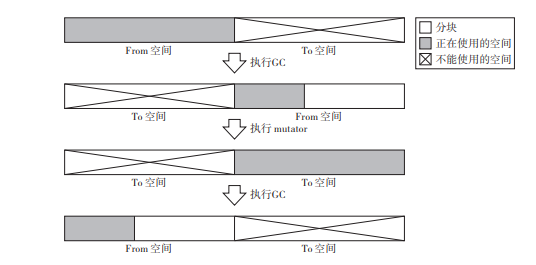

```
copying() {
    $free = $to_start
    for r: $root
        *r = copy(*r)
    
    swap($from_start, $to_start)
}

copy(obj) {
    if obj.tag != COPIED {
        copy_data($free, obj, obj.size)
        obj.tag = COPIED
        obj.forwarding = $free
        $free += obj.size

        for child: children(obj.forwarding) {
            *child = copy(*child)
        }
    }

    return obj.forwarding
}
```

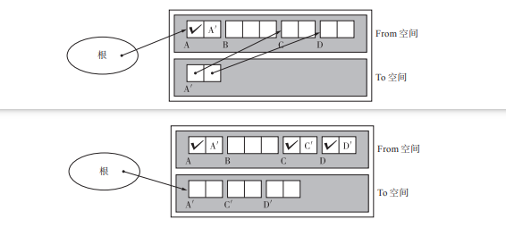

分配：
分配是最简单的，直接从From空间里面，切割一片给mutator即可，也不需要维护链表。

缺点：
1. 堆的使用效率非常低，直接砍半了
2. 使用的是递归，导致容易爆栈

## 优化
将dfs转化为bfs，但是不同导致内存分散，访问一个变量及其子对象的时候需要访问过多其他内存页，效率低下。

优化1：
将对象的子对象尽量都放到一个内存页中，虽然不能完全避免跨页引用，但是还是减少了爆栈的风险。


优化2：
本gc对于空间的利用只有一半，但是我们可以多分几份。假如分配为3份，只有两份真的保存了数据，另外一份用于复制的临时区。每次gc的时候先跟其中一份内存进行同样的gc复制算法操作，操作完成之后跟另外一份进行gc操作。

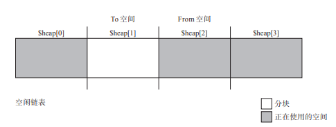

# gc标记-压缩算法

## 算法介绍
gc复制算法其实也算是压缩算法，只不过是他对于堆的利用率太低了，会直接损失堆空间

分为四步：
```
1. 标记阶段
2. 设置移动后目标指向
3. 设置子对象移动后的目标指向
4. copy数据倒目标内存块
```

1. 标记阶段跟gc标记-清除算法类似，详情可以见前文


2. 标记完成之后的效果如下图


3. 修改两个指针：一个是当前内存块的目前存储地址，一个是子对象的目标存储地址

```
void set_forwarding_ptr() {
    scan = new_address = $heap_start;
    while (scan < $heap_end)
        if (scan.mark == TRUE)
            scan.forwarding = new_address;
            new_address += scan.size;
    scan += scan.size;
}

adjust_ptr(){
    for(r : $roots)
        *r = (*r).forwarding;

    scan = $heap_start;
    while(scan < $heap_end)
        if(scan.mark == TRUE)
            for(child : children(scan))
                *child = (*child).forwarding;
    scan += scan.size
}
```


4. copy数据到目标地址


缺点：效率比较低，上面有四次搜索计算，标记-计算目标指针-计算子对象指针-移动对象，相比标记清除算法多了两次。

## 优化
优化1：two-finger算法。之前我们也有划分相同大小的内存块组成空闲链表，这里也是也可以利用同样的思路，相同大小的内存块就能很方便的计算出对象的位置，所以就能快速的找到目标位置，而不用提前标记好位置了。

优化2：表格算法。前面介绍的forwarding指针以及子对象指针的提前移动，是因为可能会被移动过去的内存给覆盖掉导致引用关系混乱。假如我们用一个单独的表格来记录对象群之间的间隙，就能通过间隙计算出移动之后的目标地址，不管是移动的目标地址还是子对象的目标地址 (当前优化的缺点就是查找每一个内存块的间隙大小需要做到很快，例如使用平衡二叉树、红黑树?)。

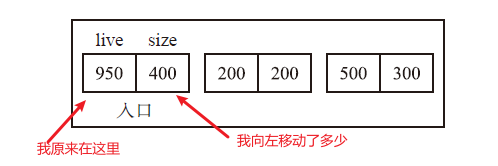


优化3：ImmixGc算法，这个算法复杂度高，有兴趣的单独去学习

# 保守式gc-准确式gc
保守式gc指的是不能准确的识别指针和非指针的gc，准确式gc则是能够正确识别指针的gc。

复杂的场景也有结构体存放指针，不能简单的判断某一部分数据是否完全是指针或者不是指针。

解决办法：
1. 打标签，通过某一个bit位标记是否为指针。
2. 间接引用，分配内存的时候是知道是否是指针的，通过一个中间层来记录是否为指针，然后这个中间层之后就能判读是否为指针。

# 分代gc
分代算法即将对象分为几代，针对不同的代使用不同的gc算法。我们把刚刚生成的对象为新生代对象，到达一定年龄的对象称之为老年代对象。

1. 新生代对象大部分都是很快就消亡了，例如跑用户的一个请求的过程中有很多堆对象，但是大部分都是随着请求的结束，也消亡了。
1. 如果经过几次gc运行之后，还没有回收的内存，我们就将其标记为老年代对象

分代gc其实就是根据gc次数来判断内存是否是易于回收的还是不易回收的。然后使用不同的算法来回收内存，就可以减少对全部内存进行遍历，增加了吞吐量，减少了最大暂停时间等等好处。这个算法并不是一个独立的算法，只是一个优化的方向。

## Unger分代垃圾回收思想

将内存空间分为四部分
1. 生成空间：生成对象的空间
2. 幸存者空间：当满足一定条件的时候(假设生成空间满了，或者定时触发)，就会触发copy到幸存者空间其中一个
3. 老年代空间：经历过几次的gc之后，还是存在于幸存者空间，那就复制到老年代空间，老年代对象由记录集来维护记录。

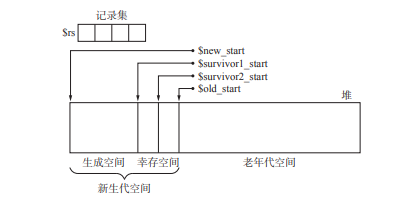

每次gc的时候都是做两次copy
1. 幸存者空间足够老的copy到老年空间
2. 生成空间的以及From空间不足够老的，copy到to空间

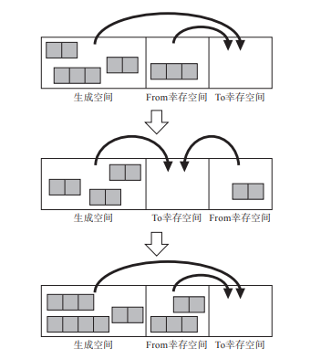

最终变成如下的形式，可能会存在老年代空间引用了新生代的内存，清理老年代的内存的时候还需要考虑清理新生代的问题，当然这里可以使用简单的标记清理算法，通过对于记录集的dfs或者bfs，就能知道已经存活的，没有存活的，就清理掉即可。


分配内存的方式则跟gc复制算法差不多，从生成空间中拿数据给mutator。

缺点：还是浪费了一部分空间，虽然相比gc复制算法已经优化了很多了

## 优化

例如
1. 多代垃圾回收：即在前面的基础之上再多区分几代
2. 列车垃圾回收算法：对于不同大小的内存再进行预划分，隔离分配回收。对于我们编程体验来讲，大部队堆上面的都很容易回收，并且占用内存小的比较多，所以这也是一个优化点。

# 增量式gc
如golang使用的三色标记算法，请见另外一篇学习笔记
