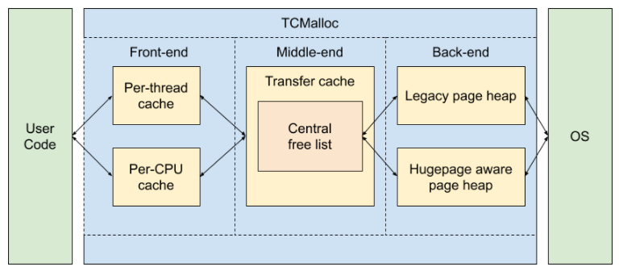
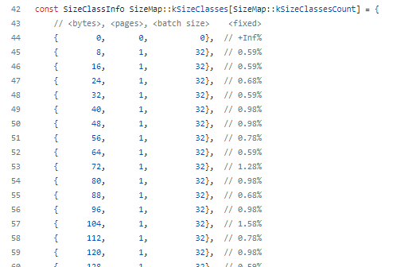
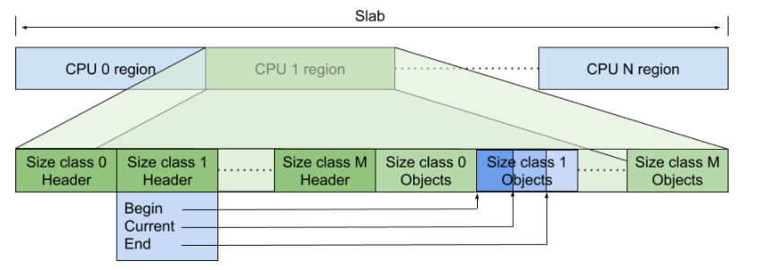
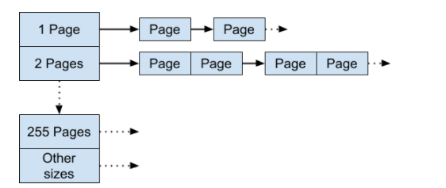
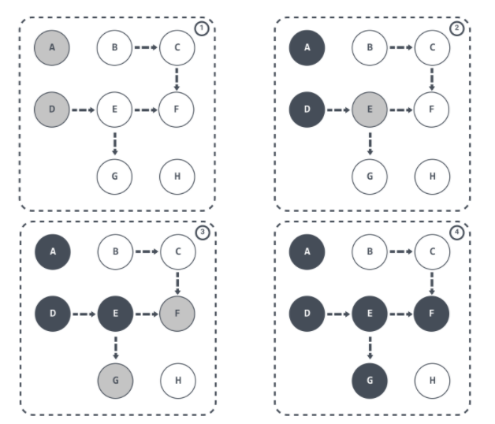
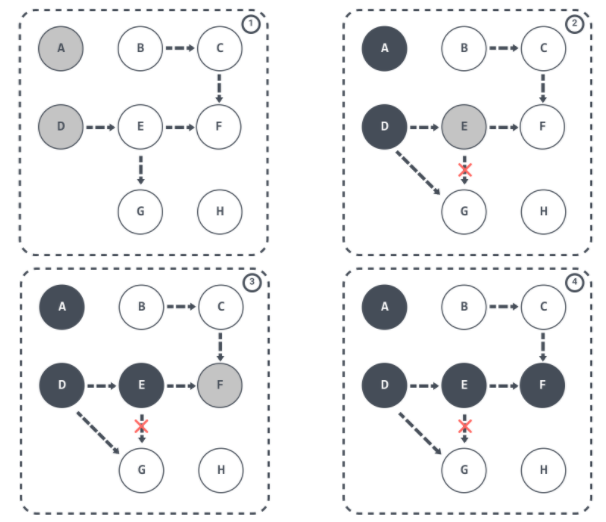

# 前言

>本文为个人学习笔记，后面有记录参考链接

golang的垃圾回收机制是无分代，不整理，并发的三色标记清除算法

* 没有碎片整理：因为使用的tcmalloc算法，基本上没有碎片真理问题
* 分代算法：分代算法是基于存活时间长短进行分代，然后减少了存储对象的检查频率。但是由于golang有变量逃逸到堆的算法，而大部分变量都是分配之后立马就需要回收，所以都放在栈上面，很方便的回收调。而逃逸到堆的就需要gc的参与，由此可见分代的优势其实不是那么明显了
* 并发gc：跟用户的代码同时运行，减少了最大的停顿时间。

# tcmalloc算法
## 简介
tcmalloc(Thread Cacheing Malloc)是google基于c/c++实现的一套高性能，并行的内存分配开源框架。

## 概要



* Front-end：它是一个内存缓存，提供了快速分配和重分配内存给应用的功能。
* Middle-end：职责是给Front-end提供缓存。也就是说当Front-end缓存内存不够用时，从Middle-end申请内存。
* Back-end：这一块是负责从操作系统获取内存，并给Middle-end提供缓存使用。它主要涉及 Page Heap 内容。

Front-end跟Back-End封装用户接口，系统接口，Middle-end用于封装不同的底层heap，然后分发给不同的缓存模式。

## Front-end

tcmalloc缓存有两种模式可以选择，以减少竞争：
* per-CPU caching(default)：是为每一个cpu建立自己的缓存，但是需要开启linux内核的 utilizes restartable sequences (RSEQ)功能，这个功能在linux 4.18版本合入。如果cpu核心太多了，那么需要维护的缓存也非常多，但是相比协程的数量那肯定还是很小的。缓存的容量是动态维护的，假如程序设置了最大值为32K，启动的时候缓存了4K，当对应获取的量越来越多的时候，缓存的值会慢慢增大。并且还能从其他cpu核心偷取容量，因为并不是每一个程序都占用了所有的核心。减少的方式则是检测到很长时间没有增长了就会进行减少。
* per-thread caching：如果linux不支持RSEQ功能，就会使用这个模式，此时tcmalloc将会为程序每一个线程维护缓存。不管是增加还是减少缓存都是通过检测缓存里面的量够不够使用，过多了减少，过少了就增加。

同时这个缓存的大小也是可配的，通过对内存的划分，加载到缓存中，可以加速内存的分配跟回收。因为是对于每一个cpu或者每一个线程维护缓存的，所以大部分是不需要加锁的，但是对于大对象的分配与回收，缓存中如果没有的时候，就需要进行加锁处理了。

对于per-thread caching，是维护了二维链表
第一维是标记竖链表内存大小，例如8 16 24 32 ...
第二维是固定内存块，当程序来拿内存的时候通过取最小的可用的内存块，如果对应的竖链接的内存块已经没了，要么从middle获取新的内存，要么就是拿更大的内存块，前者优先级高。


具体数值可以见[链接](https://github.com/google/tcmalloc/blob/master/tcmalloc/size_classes.cc),下面截图了部分数据



per-cpu中使用的是索引+数组的形式进行管理
跟上面也是一样，将同样大小的内存块放到一个数组中。分配出去了就从数组中删除，回收了就加在数组中，数组放不下了就回收给middle-end，cpu这里可以窃取其他cpu的缓存以增加容量（暂时不知道增加容量的作用）。
特殊的是，CPU的缓存在中断产生之后就会导致数据丢失，所以需要内核的RSEQ特性支持，保证执行的原子性，分配出去的缓存一定要给使用起来，不能导致游离内存块。



## middle-end

这里会为每一个大小级别的缓存提供一个Transfer缓存和Central free列表缓存，这里的缓存使用了锁进行保护。(因为不管是per-thread还是per-cpu都可能有多个点需要获取同样大小的内存块)
* Transfer Cache：维护固定大小的缓存，或者超过某一个很大的值的时候维护的是大的内存块，不会固定。如果内存块不够的时候就去Central Free List Cache中去拿缓存。
* Central Free List Cache：维护从black-end拿过来的page缓存，组合成为span，然后按照当前维护的内存块大小进行切割。


## black-end

对接的操作系统的的内存空间，主要维护的功能有：
* 管理没有使用的内存空间作为缓存，middle-end需要的时候返回给它
* 将没有没有必要维护在缓存的存储，例如已经缓存够多的时候，返回给操作系统
* 当middle-end来申请存储的时候，如果没有足够的存储，去操作系统申请存储。

这里只简单讲一下Legacy Pageheap，Hugepage Aware Allocator方式见[链接](https://github.com/google/tcmalloc/blob/master/docs/temeraire.md)



page的大小可变，单个页面作为第一个链表，两个或者k个合并成为一个内存块，放到第k个链表，当middle-end来申请的时候就可以直接除以page的大小就知道去哪个链表找对应的存储块了。

如果对应的链表已经没有内存了，有两种处理方式，一种是从os获取新的存储，一种是往下一个链表获取更大的存储块。

回收的时候需要判断page集合是否是连续的，只有是连续k个page的才能放到第k个链表中，否则就需要按需拆开存储，最终判断是否过多cache，决定是否给os回收。

# 逃逸分析
在go中我们没有明确的知道内存到底是使用栈还是使用堆，而是go在编译阶段就确定了内存到底是使用哪部分内存。

内存逃逸指的是本来是分配栈内存的，但是会导致程序出错，所以需要从栈逃逸到堆,，所以在golang中，大部分都是使用的栈，因为大部分数据都是转瞬即逝的，所以需要保证不要爆栈，好在linux默认都是由8M的

内存逃逸原则
```
1、如果函数外部没有引用，则优先放到栈中；
2、如果函数外部存在引用，则必定放到堆中；
```

程序1
```
package main

func main() {
   _ = stackIt()
}

//go:noinline
func stackIt() int {
   y := 2
   return y * 2
}
```

程序2
```
package main

func main() {
   _ = stackIt2()
}

//go:noinline
func stackIt2() *int {
   y := 2
   res := y * 2
   return &res
}
```

程序3
```
package main

func main() {
   y := 2
   _ = stackIt3(&y) // pass y down the stack as a pointer
}

//go:noinline
func stackIt3(y *int) int {
   res := *y * 2
   return res
}
```

上面三个程序通过编译即可知道,是否产生了栈内存逃逸
```
go build -gcflags '-m -l'
```
结果如下：
```
程序1：
无
# 在栈中分配内存

程序2：
./main2.go:10:4: moved to heap: res
# 对象的变量已经超出当前的作用的范围了，此时就会逃逸到堆

程序3：
./main3.go:9:15: y does not escape
# 假如变量在父接口生成后传输给了子接口，但是子接口依然是在父接口内部的的生命周期里面，就不会逃逸到堆
```

程序4:
```
# 大内存分配也会产生内存逃逸
package main

func main() {
	s := make([]int, 1000, 1000)
   for index, _ := range s {
      s[index] = index
   }
}
```

程序5：
```
# 不明确的类型产生内存逃逸，一般为interface参数的函数
package main

import "fmt"

func main() {
	fmt.Println("hello 程序猿编码")
}

$ go build -gcflags '-m -l' -o main5 main5.go
./main5.go:6:13: ... argument does not escape
./main5.go:6:14: "hello 程序猿编码" escapes to heap
```

# 三色标记

三色标记法的三种颜色：
* 白色：开始阶段所有的对象都是为白色，如果gc标记完成之后还是白色即为垃圾。
* 灰色：正在处理的对象，该对象已经被标记过了，但该对象下的属性没有全被标记完。
* 黑色：该对象已经被标记过了，且该对象下的属性也全部都被标记过了。

标记过程(理解为深度搜索or广度搜索即可)：

在垃圾收集器开始工作时，从 GC Roots 开始进行遍历访问，访问步骤可以分为下面几步：

1. 初始化所有对象为白色。
1. GC Roots 根对象会被标记成灰色；
1. 然后从灰色集合中获取对象，将其标记为黑色，将该对象引用到的对象标记为灰色；
1. 重复步骤3，直到没有灰色集合可以标记为止；
1. 结束后，剩下的没有被标记的白色对象即为 GC Roots 不可达，可以进行回收。



## 写入屏障

写入数据与跟gc的并发问题产生错误识别垃圾或者未及时回收垃圾的情况如下：

1. 写入的过程中指针引用被改变了，导致gc没有办法对灰色的节点的子节点进行标记


2. 当被标记为灰色的时候，灰色的内存变量不使用的时候，当然这个失误可以在下一次gc过程中被检测出来


### Dijkstra Write barrier
```
writePointer(slot, ptr):
    shade(ptr)
    *slot = ptr
```

通过这种办法可以保证强三色不变形：黑色对象不会指向白色对象，只会指向灰色对象或者黑色对象

被解引用的对象，在下次gc过程中可以被回收。

### Yuasa Write barrier

```
writePointer(slot, ptr)
    shade(*slot)
    *slot = ptr
```
将ptr的上一级内存标记为灰色，就可以出发gc扫描ptr指针了，而之前指向的指针由于已经没有引用关系了，在下次gc过程中也能进行回收调。

# 发散点

1. gc的工作是使用25%的cpu进行清理的，所以有可能清理的速度比产生垃圾的速度慢，所以这里需要程序自己编写清理的机制，或者看看最新的golang是否有新的控制的方式。
2. gc时机：(1) 堆内存增长一倍的时候触发gc，由环境变量GOGC 控制的 (2) 定时触发 (3) 达到某一个阀值的时候触发 (4) 主动触发等等。

gc的[源码](https://github.com/golang/go/blob/master/src/runtime/mgc.go)大致流程如下


# 参考

* [逃逸分析](https://medium.com/eureka-engineering/understanding-allocations-in-go-stack-heap-memory-9a2631b5035d)
* [tcmalloc github link](https://github.com/google/tcmalloc)
* [三色标记](https://www.cnblogs.com/luozhiyun/p/14564903.html)
