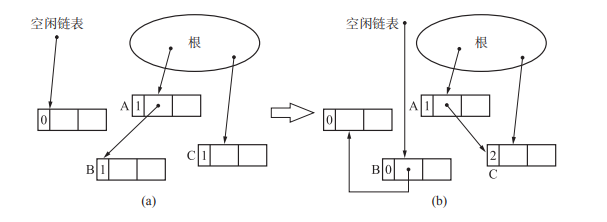
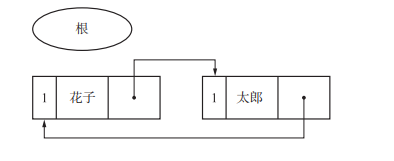
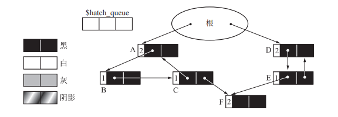
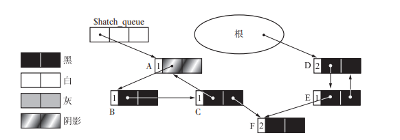
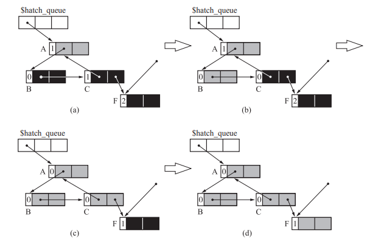
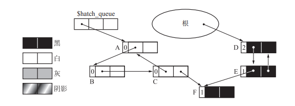
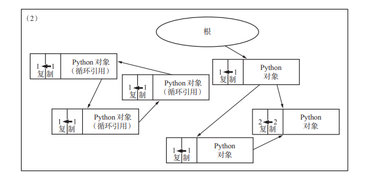
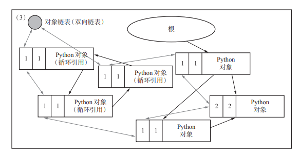
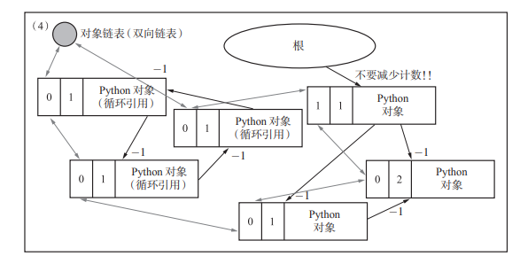
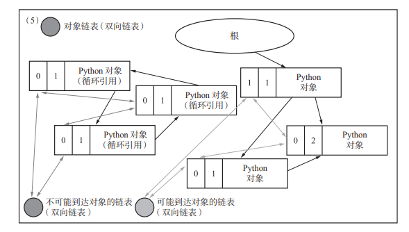

# 引用计数算法简介
引用计算算法就是记录一个内存对象有多少个父对象引用自己的算法，是George E. Collins于1960年钻研出来的算法

## 分配
分配内存的时候，一旦分配成功，就会初始化对应内存的引用计数为1

```
new_obj(size) {
    obj = pickup_chunk(size, $free_list)

    if obj == NULL {
        allocation_fail()
    } else {
        obj.ref_cnt = 1
        return obj
    }
}
```

## 不使用对象时
将```obj.ref_cnt--```，如果ref_cnt为0，则将对象进行回收

```
dec_ref_cnt(obj) {
    obj.ref_cnt--
    if obj.ref_cnt == 0 {
        for child: children(obj) {
            dec_ref_cnt(*child)
        }

        reclaim(obj)        # 将内存连接到空闲链表
    }
}
```

## 更新指针指向



```
update_ptr(ptr, obj) {
    # 下面两行的顺序不能变，因为先删的话可能会触发直接回收调内存了
    inc_ref_cnt(obj)
    dec_ref_cnt(*ptr)
    *ptr = obj
}

inc_ref_cnt(obj) {
    obj.ref_cnt++
}
```
## 优点
1. 随时可以回收内存，只要引用计数为空了
1. 最大的暂停时间短，因为回收内存不需要控制整个内存区域进行回收
2. 并且没有必要沿着指针进行搜索查找

## 缺点
1. 计数器值增减处理很频繁
2. 计数器就需要占用很多内存，假如我们有2的32个对象引用了一个指针，那么就需要至少32位来保存所有的数据，假如实际的数据就只有32位大小，这样就导致了内存的利用率直线下降了
3. 实现繁琐复杂。看似简单的东西但是容易操作失误，导致引用计数出错，本来普普通通的 *ptr=obj 却需要调用update_ptr(ptr, obj)。试想内存管理模块有很多自己的操作(支撑语言的层面)，是 *ptr=obj，还需要区分为语言本身的内存分配，容易出错。
4. 循环引用无法回收。



# 优化
## sticky引用计数法
使用5个bit的来记录引用数量，如果引用计数溢出了，主要有两种解决办法
1. 什么都不做 (因为大多数对象的引用计数都是0与1的范围变化，很少出现溢出，如果溢出了，一般也是极其重要的对象，用户瞎搞的除外)
2. 在适当时机用gc标记-清除算法来充当引用计数法的后援，伪代码如下

```
mark_sweep_for_counter_overflow(){
    reset_all_ref_cnt()         # 将所有的引用计数都清零
    mark_phase()
    sweep_phase()
}


mark_phase(){                   # 标记阶段
    for(r : $roots)
        push(*r, $mark_stack)

    while(is_empty($mark_stack) == FALSE)
        obj = pop($mark_stack)
        obj.ref_cnt++           # 被引用了一次增加一次(可以增加限制，不让其溢出)

        if(obj.ref_cnt == 1)    # 只遍历过一次
            for(child : children(obj))
                push(*child, $mark_stack)
}


sweep_phase(){
    sweeping = $heap_top
    while(sweeping < $heap_end)
        if(sweeping.ref_cnt == 0)   # 没有被引用过
            reclaim(sweeping)       # 加入空闲链表
        sweeping += sweeping.size
}
```

优点：
1. 可以回收循环的垃圾
2. 不用理会溢出

我的理解是这个算法只能是配合引用计数，因为引用计数大部分时候还是没有问题，只是偶尔可能需要来处理一下循环引用以及引用溢出的问题。两个gc算法综合在一起就能解决所有问题了

## 一位引用计数法
就是sticky引用计数法的极端情况，使用一位来记录是否被使用了。

## 部分标记-清除算法
由于引用计数算法由很明显的缺点：循环引用。所以本算法是用来配合引用计数来解决循环引用的问题的。

用两位bit即可标明四种颜色

1. 黑（BLACK）：绝对不是垃圾的对象（对象产生时的初始颜色）
2. 白（WHITE）：绝对是垃圾的对象
3. 灰（GRAY）：搜索完毕的对象
4. 阴影（HATCH）：可能是循环垃圾的对象

初始状态，其中对象 A D C 是循环引用



断开根到A的引用关系
```
dec_ref_cnt(obj){
    obj.ref_cnt--
    if(obj.ref_cnt == 0)            # 如果已经计数为0，直接删除即可
        delete(obj)
    else if(obj.color != HATCH)     # 否则就标记为阴影
        obj.color = HATCH
        enqueue(obj, $hatch_queue)  # 加入阴影队列
}
```



将hatch阴影队列里面引用的对象都标记为灰色，并且将计数减一

```
paint_gray(obj){
    if(obj.color == (BLACK | HATCH))    # 将黑色|阴影涂成灰色
        obj.color = GRAY
        for(child : children(obj))      # 如果是黑色|阴影，计数就会减一
            (*child).ref_cnt--
            paint_gray(*child)
}
```



```
scan_gray(obj){
    if(obj.color == GRAY)
        if(obj.ref_cnt > 0)
            paint_black(obj)        # 如果计数不为0，则是活跃对象
    else
        obj.color = WHITE           # 否则就是垃圾
        for(child : children(obj))
            scan_gray(*child)
}
```



最后将白色对象给回收掉即可

缺点：
1. 多次去标记颜色，搜索的次数也上去了，导致gc的时长以及最大暂停时间也变长了

# python 引用计数

只讲几个关键问题
## 计数器是否会溢出

```
#if SIZEOF_VOID_P <= SIZEOF_INT
typedef int		Py_intptr_t;
#elif SIZEOF_VOID_P <= SIZEOF_LONG
typedef long		Py_intptr_t;


typedef Py_intptr_t	Py_ssize_t;


typedef struct _object {
	_PyObject_HEAD_EXTRA
	Py_ssize_t ob_refcnt;           # 跟系统相关，计数大小够所有的对象指过去
	struct _typeobject *ob_type;
} PyObject;
```

## 循环引用如何解决
1. 将原始的引用计数复制一份



2. 将所有的对象都链接到对象链表中，途中标注的只有两条线，现实中可以跟每一个对象都存在链接



3. 将除了根链接的对象之外，都进行减一，导致除了根引用的对象之外都变成了0，而还是为1的则是活动对象，由这部分对象可以到达的子对象也都是活动对象(可到达对象)。其他的则是垃圾对象(不可到达对象)



4. 将可到达对象、不可到达对象分别链接到不同链表，最终将不可到达对象回收掉，即完成循环对象的垃圾回收



```
# 循环引用通过del删除也没有办法删除掉，除非程序直接退出或者主动调用gc
import time

class A:
    def __init__(self):
        print("Object A Created")

    def __del__(self):
        print("Object A Destroyed")

class B:
    def __init__(self):
        print("Object B Created")

    def __del__(self):
        print("Object B Destroyed")

#creating two objects
a = A()
b = B()

#setting up circular reference
a.b = b
b.a = a

#deleting objects
del a
del b

time.sleep(3)

import gc
gc.collect()

time.sleep(3)
```

```
# 使用弱引用
import weakref
import time

class A:
    def __init__(self):
        print("Object A Created")

    def __del__(self):
        print("Object A Destroyed")

class B:
    def __init__(self):
        print("Object B Created")

    def __del__(self):
        print("Object B Destroyed")

#creating two objects
a = A()
b = B()

#setting up weak circular reference
a.b = weakref.ref(b)
b.a = weakref.ref(a)

#deleting objects
del a
del b

time.sleep(3)
```

python是才3.4开始接近循环引用问题的，[官方关于循环引用的链接](https://www.python.org/dev/peps/pep-0442/)


